# Setting-Up Service Account
### 1. Browse to `https://console.cloud.google.com`
Open google cloud platform (GCP) console dashboard at [https://console.cloud.google.com](https://console.cloud.google.com).

### 2. Select Your Project
Select your existing project or you can create new project.

#### 2.1 Click the project name navigation

#### 2.2 Search and choose project
If you want to create new project, click `New Project` button on the top-right side of the modal.

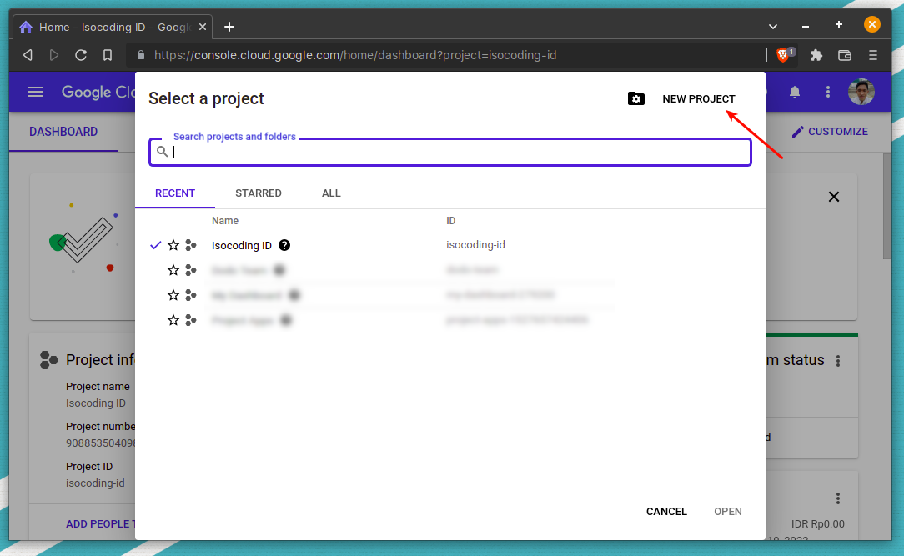

### 3. Navigate to `Service Account` Page
After that, navigate to service account management page.
1. Open sidebar navigation menu
2. Hover to `IAM & Admin`
3. Tap `Service Accounts` menu

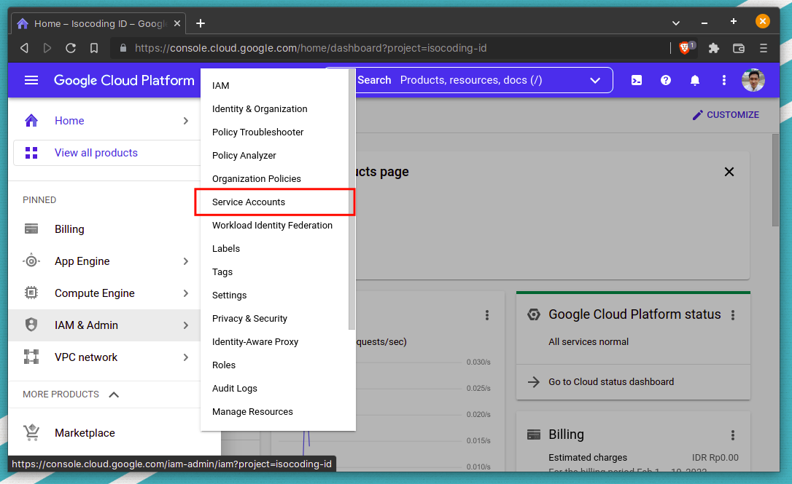

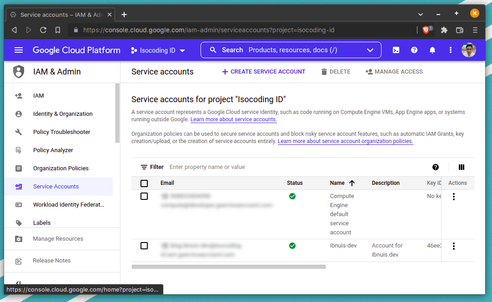

### 4. Create Service Account and Credentials

#### 4.1 Click `Create Service Account` Button
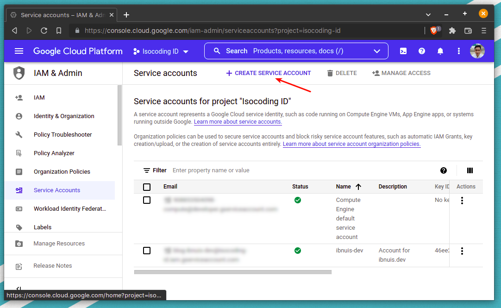

#### 4.2 Follow the step to create the account

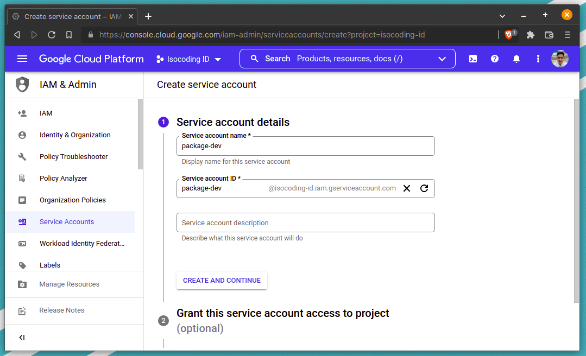

#### 4.3 Generate secret to get credentials payload

Click `Manage Key` menu from service account management table

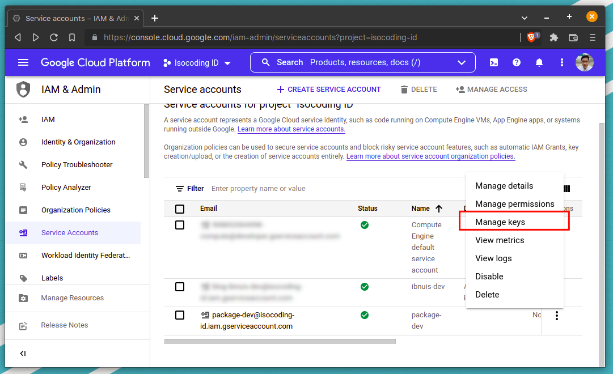

Navigate to `Key` tab and click `ADD KEY` button

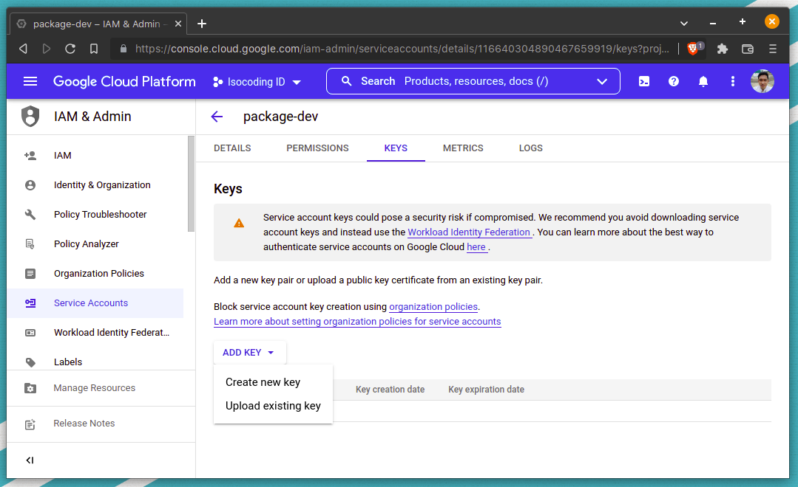

Choose Key Type as JSON, then click Create. It will download json file which will be use as credentials in our app.

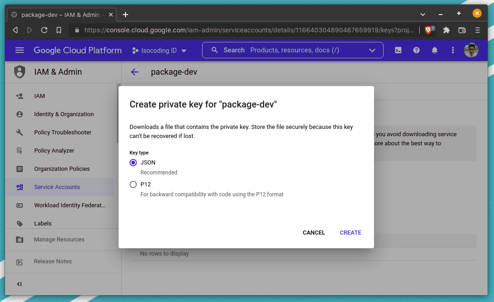

### 6. Enable `Google Sheet API` Service

#### 6.1 Search `Google Sheet` as keyword at searching form

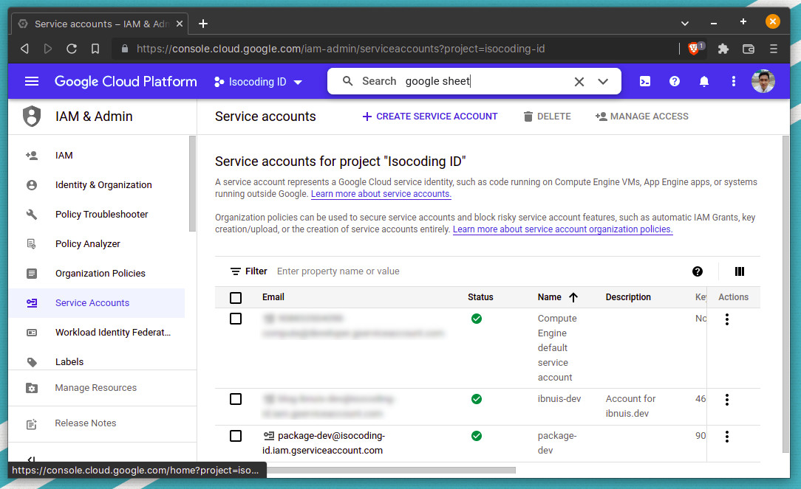

#### 6.2 Select `Google Sheet API` from result list

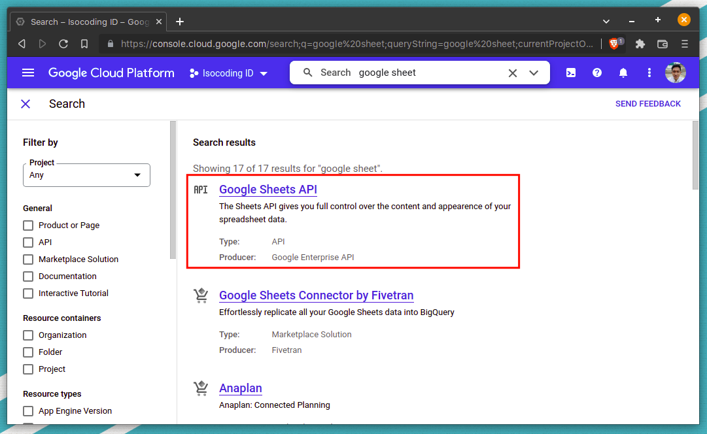

#### 6.3 Enable the API

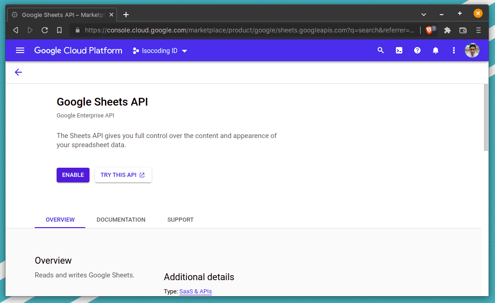

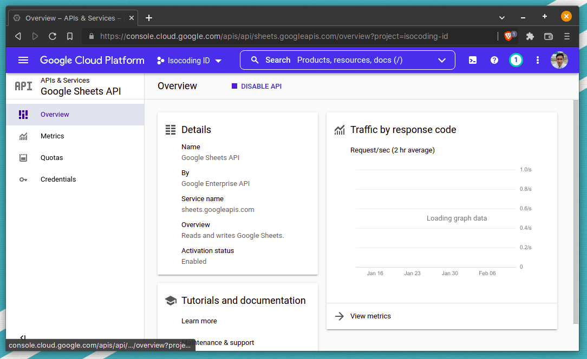

### 7. Share your Sheet Document

#### 7.1 Back to Service Account Management Page

Copy the email of your service account

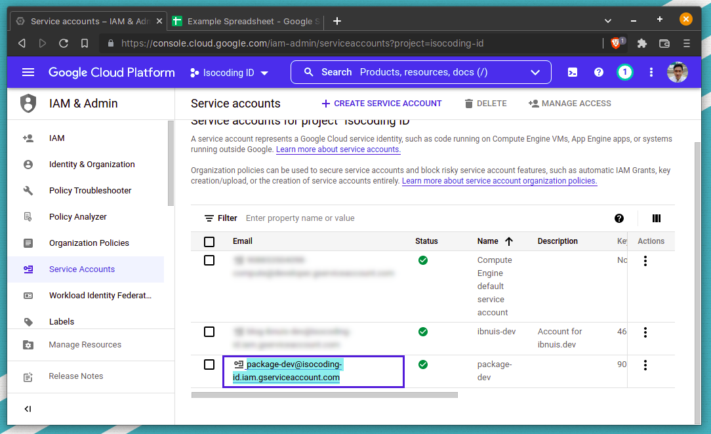

#### 7.2 Open up your Sheet file then Share it

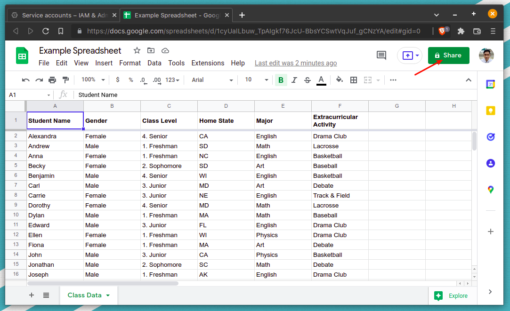

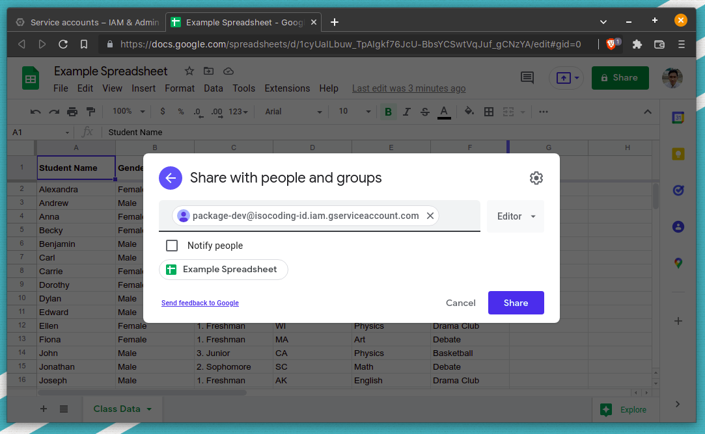